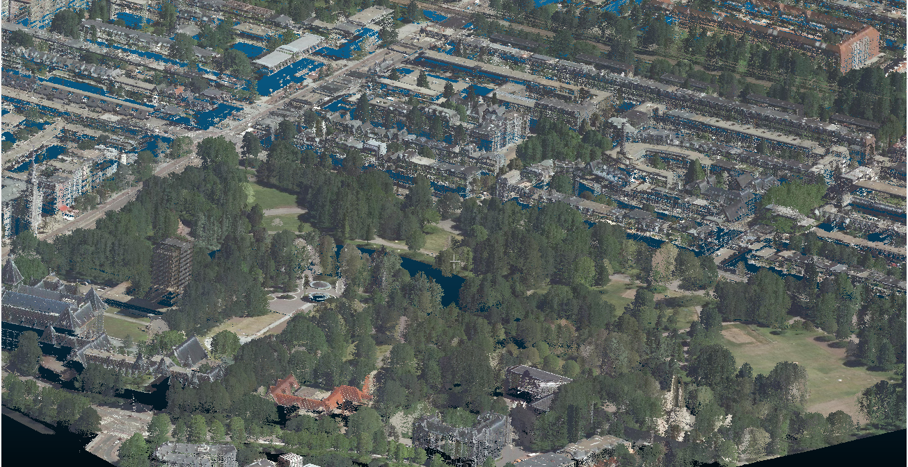
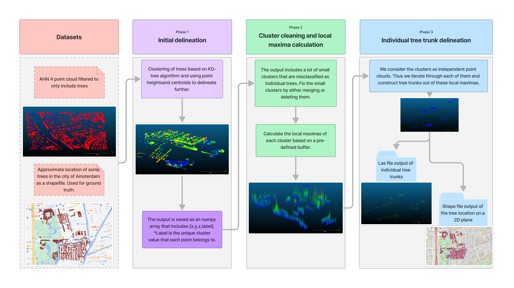

# Individual Tree Trunk Segmentation README
This repository contains the code to segment individual tree trunks out of an lidar point clouds that's already been filtered to contain only tree points.
The algorithm uses simple libraries and makes full use of the point cloud data structure to ensure speed and efficenty in caclulations.




Below it's the output of a sample dataset taken from the city of amsterdam:


---


## Project Folder Structure

The repository contains the full codes used and a sample data that can be used to test the code.


1) [`resources`](./resources): Random nice resources, e.g. [`useful links`](./resources/README.md)
1) [`src`](./src): Folder for all source files specific to this project
1) [`scripts`](./scripts): Folder with the full scripts of the tree trunks delineation code.
1) [`tests`](./tests) Test example
1) [`Sample_test`](Sample_test): This is a small las file that can be used to test the code and get and output.
1) ...


```


## Installation

Explain how to set up everything. 
Let people know if there are weird dependencies - if so feel free to add links to guides and tutorials.

A person should be able to clone this repo, follow your instructions blindly, and still end up with something *fully working*!

1) Clone this repository:
    ```bash
    git clone https://github.com/Amsterdam-Internships/Tree-trunk-segmentation.git
    ```

---


## Usage

Explain example usage, possible arguments, etc. E.g.:

To train... 


```
$ python train.py --some-importang-argument
```

## How it works

Below is the simplified workflow that shows how the algorithm works and what logic it is built on:


---
## Acknowledgements

I would like to express my sincere appreciation to my two internship supervisors, Daan Bloembergen and Nico de Graaff, as well as my university professor, Sander Oude Elberink, for their invaluable guidance and support throughout the development of this project.Their extensive knowledge and experience in the field provided helped me to better understand the complexities of the project and achieve a successful outcome.

Our code uses [YOLOv5](https://github.com/ultralytics/yolov5) [](https://zenodo.org/badge/latestdoi/264818686)

